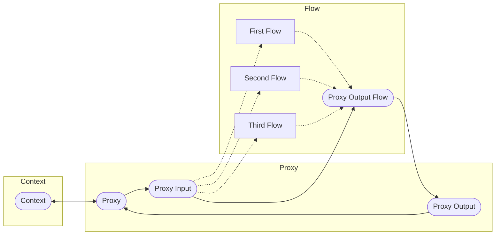

# CPF (Context-Proxy-Flow) framework specification

## Description

The CPF framework helps you build a clear and transparent workflow.
It consists of three scopes: `Context`, `Proxy`, and `Flow`.
This framework defines data flows and workflows that can be scaled.
Each component can be expressed as a function, making downstream-to-upstream communication easy.

## Example

This flowchart has three Flow components: `First Flow`, `Second Flow`, and `Third flow`.

## Why is including Proxy scope?

Context-Flow framework is simpler than the CPF framework, but this framework doesn't provide grouping functionally.
The CPF framework has this functionally, we will have control over all our data.

## Classes

1. `Component`: Immutable base class.
2. `Sequential Component`: This component has one input and one output.
3. `Parallel Component`: This component has infinite inputs and infinite outputs.
4. `Flow Component`: `Sequential Component` or `Parallel Component`.
This can output to any Flow component.

## Scopes

1. `Context`: This scope means any context.
2. `Proxy`: This scope can be defined with in the `Flow` scope.
3. `Flow`: This scope can have infinite `Flow` components.

## Basic components

1. `Context` (in `Context` scope): `Parallel Component`.
This component has infinite inputs and infinite outputs.
3. `Proxy` (in `Proxy` scope): `Sequential Component`.
This component can connect to the `Context` component with one input and one output.
5. `Proxy Input` (in `Proxy` scope): `Parallel Component`.
This component is input by the `Proxy component`.
7. `Proxy Output` (in `Proxy` scope): `Sequential Component`.
This component can output to the `Proxy` component.
9. `Proxy Output Flow` (in `Flow` scope): `Sequential Component`.
This component can output to the `Proxy Output` component.

## Usage

1. Create a new `Flow` component from `Proxy Input` component.
When grouping, use `Proxy` component instead of it.
3. Repeat the previous step.

## Note

Describing every workflows is not a good approach.
A good approach is to describe all workflows succinctly.

## Expression

### Grouping

Any group works as goals, departments, or headings.

### If logic

If logic can be expressed as a `Parallel Component`.

### For logic

For logic can be expressed as a connection to other `Flow` components.

## Application

Existing frameworks can be expressed as `Flow` components.
For example, Scrum framework or Pomodoro technique.
